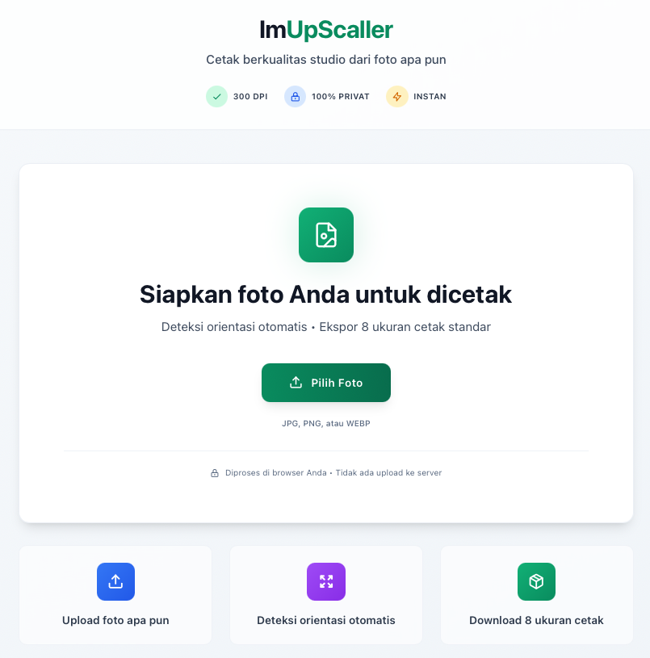

<div align="center">

# 📸 ImUpScaller

**Cetak berkualitas studio dari foto apa pun**

[](https://react.dev)
[](https://vitejs.dev)
[](https://tailwindcss.com)

</div>

---

## 📸 Preview



---

## 🎯 Tentang

Web app untuk menyiapkan gambar ke format cetak profesional 300 DPI. Semua proses dilakukan di browser — **100% privat, tidak ada upload ke server**.

### Fitur Utama
✅ **Deteksi orientasi otomatis** (Potret/Lanskap)  
✅ **8 ukuran cetak standar** (5×7 hingga 24×36 inci + A2)  
✅ **Pilih ukuran dengan checkbox** — download hanya yang dipilih  
✅ **Download ZIP batch** dengan file asli + ukuran terpilih  
✅ **Nama file kustom** (contoh: `FotoSaya_8x10in.jpg`)  
✅ **Metadata DPI otomatis** (JFIF APP0 injection)

---

## 🚀 Quick Start

```bash
# Install dependencies
npm install

# Development server
npm run dev

# Production build
npm run build
```

Buka `http://localhost:5173`

---

## 📐 Ukuran Cetak Tersedia

**Inci:** 5×7, 8×10, 9×12, 11×14, 16×20, 18×24, 24×36  
**Metrik:** A2 (420×594 mm)

**Mode Resize:** Stretch (no crop) — gambar di-stretch untuk mengisi frame target tanpa cropping

---

## 💻 Tech Stack

- **React 18** + **Vite** — Fast refresh & modern bundling
- **Tailwind CSS** — Utility-first styling
- **Canvas API** — Client-side image processing
- **JSZip** (via CDN) — Batch ZIP downloads
- **Lucide React** — Modern icon system

---

## 📁 Struktur Project

```
src/
  ├── App.jsx         # Main component (logic + UI)
  ├── main.jsx        # React entry point
  └── index.css       # Global Tailwind styles
index.html            # HTML template
vite.config.js        # Vite configuration
vercel.json           # Vercel deployment config
```

---

## 🎨 Cara Pakai

1. **Upload foto** (JPG, PNG, WebP)
2. **Set nama file** di input "Nama File Output"
3. **Klik card ukuran** untuk pilih/batal pilih
4. **Download:**
   - **Individual:** Klik tombol "Download" di card
   - **Batch ZIP:** Klik "Download Terpilih (X)" di header

---

## 🔒 Privasi & Keamanan

✅ **Zero server upload** — semua proses di browser  
✅ **Zero data tracking** — tidak ada analytics  
✅ **Instant processing** — tidak ada queue


---

## 📄 License

MIT — Free for personal & commercial use

---

<div align="center">

**Made with ❤️ for everyone**

</div>
